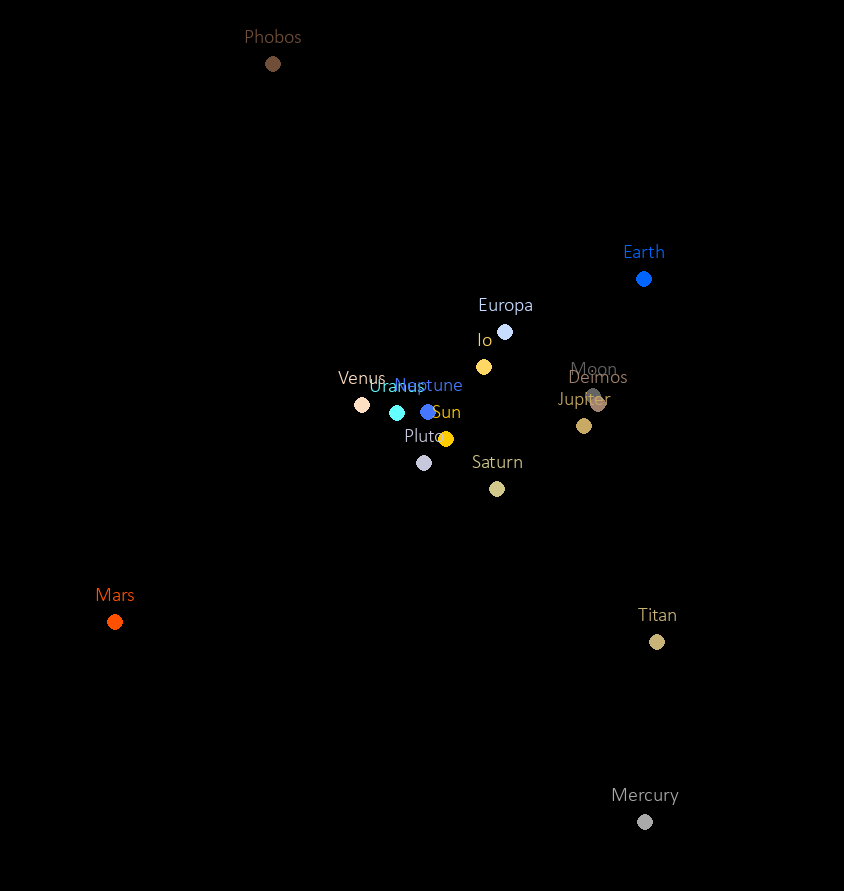
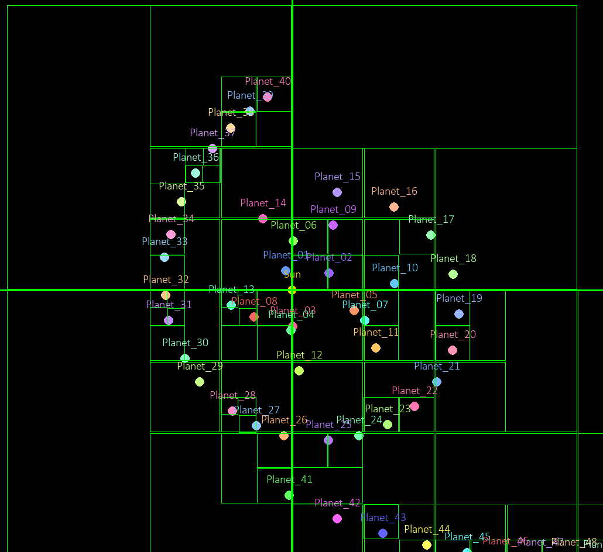

# 2D-Gravity-Simulation

A program to run customizable 2D simulations of gravity defined in YAML files with the Barnes-Hut algorithm for faster computation.
[Barnest-Hut Algorithm](https://arborjs.org/docs/barnes-hut)

## Running
To run the program using UV, clone the repo and run the below command:

`uv run gravity-sim saves/half_solar_system.yaml`

To run a simulation of half of the solar system.

Without UV, create a venv and install dependencies with the following commands:

```shell
py -m venv .venv
.venv/Scripts/Activate
pip install .
```

Then run an example simulation with:

`python -m gravity_sim saves/half_solar_system.yaml`

## Controls
Certain keybinds can be used to control the simulation:
- Space - Pause/play simulation
- Right Arrow - Increment focused object
- Left Arrow - Decrement focused object
- Period - Increase speed
- Comma - Decrease speed
- N - Toggle names
- Q - Toggle displaying the quadtree

## Example saves
The program comes with some example saves to try out:

1. `half_solar_system.yaml` - The sun and the first 4 planets and their moons.
2. `solar_system.yaml` - The sun and all the plants in the solar system and most of their moons.
3. `jupiter.yaml` - Jupiter and 15 of it's moons
4. `random.yaml` - The sun and 6 earths at random positions
6. `galaxy.yaml` - Galaxy like simulation containing 80 bodies, serves as a stress test

To run any of these saves, simply run the program and pass in the path to the config to use, e.g:

`uv run gravity-sim saves/jupiter.yaml`

## Creating a simulation
Simulations are defined in `.yaml` files, here is an example save:

```yaml
name: "Earth and Moon"
timestep: 2500
steps: 16
description: "Sun, earth and moon"
objects:
  - name: Sun
    mass: 1.989e30
    position: [0, 0]
    velocity: [0, 0]
    color: [255, 204, 0]
  - name: Earth
    mass: 5.972e24
    position: [149_597_870_700, 0]
    velocity: [0, 29_780]
    color: [0, 100, 255]
    satellites:
    - name: Moon
      mass: 5.972e22
      position: [363_300_000, 0]
      velocity: [0, 1046]
      color: [100, 100, 100]
```
Several parameters are required:

- `name` - Name of the simulation.
- `timestep` - The amount in seconds to advance the simulation each frame.
- `steps` - The number of separate calculations to do for each frame. Higher = more accurate simulations but worse performance.
- `description` - A description of the simulation
- `objects` - The objects in the simulation

For each object:
- `name` - Name of the object
- `mass` - The mass of the object in kg, must be an integer or scientific number
- `position` - The x, y position of the object in meters, must be integers or scientific notation
- `velocity` - The x, y velocity of the object in metres/second, must be integers or scientific notation
- `color` - RGB color of the object
- `satellites` - Any objects defined here will **inherit** the position and velocity of the parent object. This makes it easier to define moons of an object. In this example the moon inherits the position and velocity of the earth, so only the moon's orbital speed and distance are required.

### Random values
The program allows for mass, velocity, position and color to be randomised.
Take the example configuration:

```yaml
# random_sim.yaml
name: "Random Earth Sized Planets"
timestep: 5000
seed: 10
steps: 16
description: "A random solar system simulation"
objects:
  - name: Sun
    mass:
      max: 1e30 # Random mass
      min: 1e20
    position: [0, 0]
    velocity: [0, 0]
  - name: Earth
    mass: 5.972e24
    position:
      max: [200_597_870_700, 0] # Random position
      min: [50_597_870_700, 0]
    velocity:
      max: [5e9, 3e5] # Random velocity
      min: [-5e9, -2e2]
```

- `mass` - Can be randomised by providing a `max` and `min` value instead of an exact value. A random value will be generated between these values (inclusive)
- `position` - Position can be randomised by providing the max x and y values, and the min x and y values to use. Note a value in a random vector can be fixed by just providing it twice for the max and min.
- `velocity` - Similarly to position, velocity can be randomised in the same way
- `color` - Color can be randomised by just excluding it. Random RGB values between 50-200 will be chosen.


## Debugging
An example launch.json config would look something like this:
```json
"configurations": [
    {
        "name": "Random.yaml",
        "type": "debugpy",
        "request": "launch",
        "module": "gravity_sim",
        "console": "integratedTerminal",
        "args": [
            "saves/[SAVE-TO-USE].yaml"
        ],
    }
]
```

## Images

### Simulation Screen



The solar system except the sun has zero mass.



A simulation with the quadtree used for force calculations visualised.

## Requirements
- Python
- UV (optional, makes it easier to run)