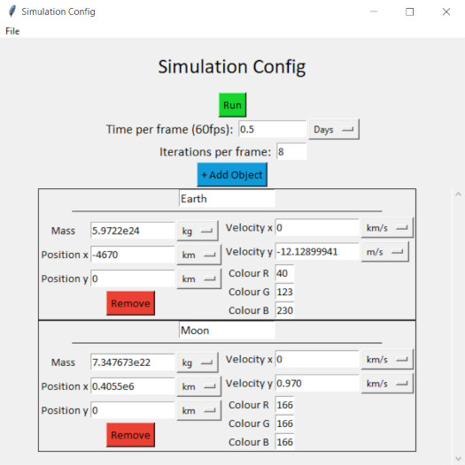
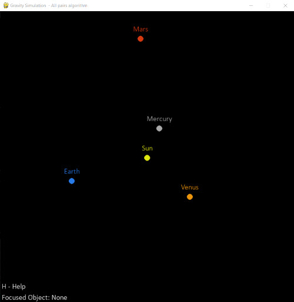
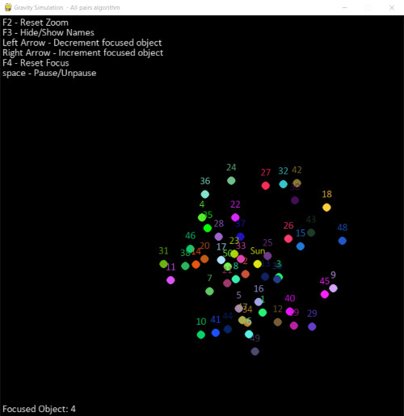
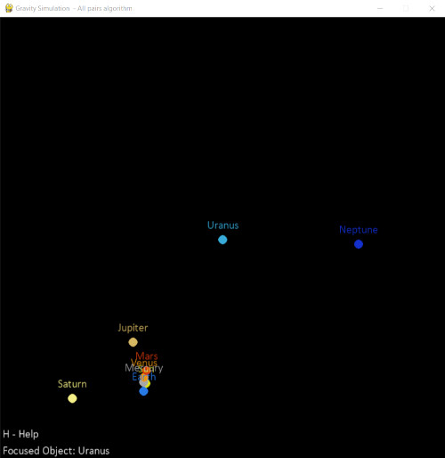

# 2D-Gravity-Simulation

 A simple, customisable simulation of 2D gravity.
 Visualised using Pygame and configured using a Tkinter window.
 Includes the ability to save and load simulation configurations.
 Uses the all-pairs algorithm, every object is compared to every other object.
 This could be improved using the Barnes Hut algorithm, which I might implement in the future.

 Given an array of gravitational objects treated as point masses, the simulation best estimates how these objects will interact with each other.
 Using the mass and positions of several points, the forces between them can be calculated and thus their resultant acceleration, which can be used to produce a simulation of their future movements.

## Features

1. Saving and loading simulation config
2. Refocus which object is being viewed in the simulation
3. View object names during the simulation
4. Infinitely adjust the scale by scrolling up or down
5. Adjustable units in the config menu
6. Pausing/playing

## Getting started

### Making objects

To start the program, run [main.py](main.py)

You will be presented with the simulation config screen.

From here you can use the 'file' menu to load some pre-created simulation configurations, or you can click the 'add object' button to introduce your own object into the simulation.

The default units are all SI units, and the required values are:

- Mass
- X and Y coordinates
- Velocity in the X and Y direction
- RGB color values
- And a cool name

You don't have to use the default units, for example the mass unit can be set to '10xSuns', so inputting a value of 1 will give you 10 solar masses instead of a kilogram.

Once you've added all your values and set up your simulation, click 'run' to start it.

You can close the simulation at any time and be sent back to the config screen.

### Config options

#### Time per frame

The 'time per frame' box allows you to set the time that passes each frame of the simulation, setting it to 0.5 days means the simulation runs at 0.5 x 60fps = 30 days of simulation time per real world second.

#### Iterations per frame

The 'iterations per frame' box allows you to add in additional calculations between the value of time that you specified. For example, setting it to 10 means that instead of computing object X's position on day 0 and the jumping to day 10, it calculates its position and its interactions with all other objects on days 1 through to 10, and only visually displays the results of day 10.

Setting this to a high value greatly increases the accuracy of the simulation, and can stop objects from 'flying off' under strong gravitational forces, but significantly increases the processing power needed, so only set it to a high value when you have a low number of objects.

**TLDR; Time per frame = speed of simulation, iterations per frame = how accurate the simulation is**

## Debugging
An example launch.json config would look something like this:
```json
"configurations": [
    {
        "name": "Random.yaml",
        "type": "debugpy",
        "request": "launch",
        "module": "gravity_sim",
        "console": "integratedTerminal",
        "args": [
            "saves/[SAVE-TO-USE].yaml"
        ],
    }
]
```

## Images

### Config Screen



### Simulation Screen



The planets in our inner Solar System



A very busy solar system



A simulation of the planets in our solar system (- pluto)

## Requirements

Python 3

Pygame 2 and above

## Thanks

Big thanks to mp035 on Github for his scrollable frame widget in Tkinter.
This code can be found in the [scrollableFrame.py](classes/scrollableFrame.py) file contained in the classes folder.
